<div align="center">


<h1>Streaming Ingestion Hub</h1>

<p><strong>The Strategic Data Ingress & Processing Plane for Global Real-time Intelligence and Distributed Stream Governance</strong></p>

[]()
[]()
[]()

<br/>

> **"Data in motion is data with purpose."** 
> Streaming Ingestion Hub (Stream-Ops) is an enterprise-grade platform designed to provide a secure, measurable, and highly automated foundation for global real-time data ingestion. It orchestrates the complex lifecycle of stream management—from multi-source ingestion and partition-aware message brokering to real-time transformations, schema validation, and strategic routing. By providing a centralized command center with real-time throughput visibility, automated data quality enforcement, and immutable audit logging, it enables organizations to eliminate data silos, reduce end-to-end latency, and ensure consistent architectural excellence across every tier of the global data infrastructure.

</div>

---

## 🏛️ Executive Summary

In a real-time world, batch processing is a liability. Organizations fail to leverage data not because of a lack of volume, but because of fragmented ingestion pipelines, inconsistent data quality, and the inability to process and route streams at the speed of business.

This platform provides the **Streaming Data Plane**. It implements a complete **Streaming Intelligence Framework**—from automated partition-based brokering and real-time transformation engines to a specialized stream monitoring dashboard and routing hub. By operationalizing ingestion at scale, it ensures that your data is not just "moving," but continuously processed, validated, and delivered with strategic precision.

---

## 🏛️ Core Platform Pillars

1. **Multi-Source Ingestion**: Centralized hub for ingesting real-time events via HTTP, Webhooks, and batch streams.
2. **Distributed Broker Engine**: Partition-aware messaging logic (Kafka-sim) ensuring scalability and message ordering.
3. **Real-time Transformation Engine**: Policy-driven stream processing for filtering, enrichment, and windowed aggregations.
4. **Strategic Routing Engine**: Rule-based logic for delivering processed streams to multiple destinations (Sinks).
5. **Data Quality & Schema Governance**: Automated validation of event schemas and quality rules to prevent stream pollution.
6. **Cluster Observability**: Deep monitoring of throughput, latency, and consumer lag across the entire streaming cluster.

---

## 📐 Architecture Storytelling: 50+ Advanced Diagrams

### 1. The Streaming Ingestion Loop
*The flow from raw event ingestion to routed data sink.*
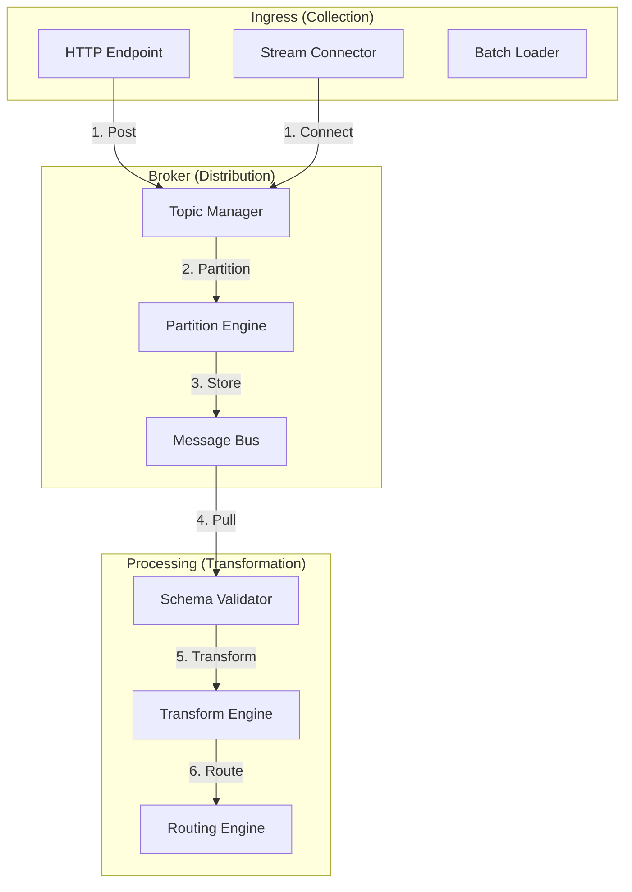

### 2. Broker Partition Topology
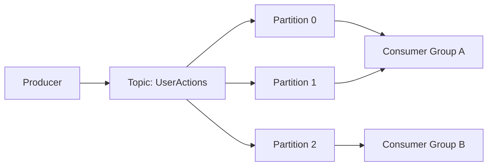

### 3. Stream Processing Pipeline
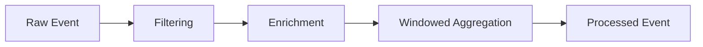

### 4. Streaming Platform Architecture
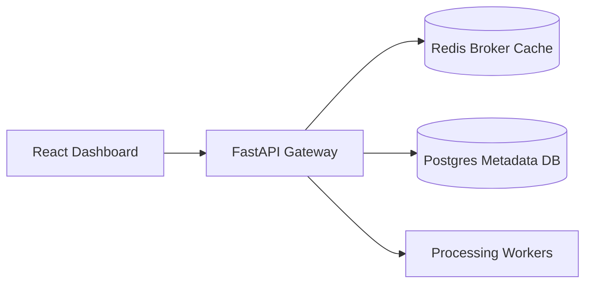

### 5. Deployment Topology: High-Available Streaming Hub
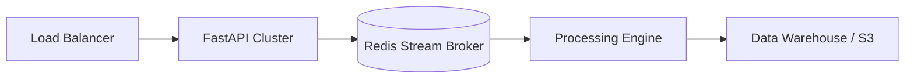

### 6. Data Quality Flow
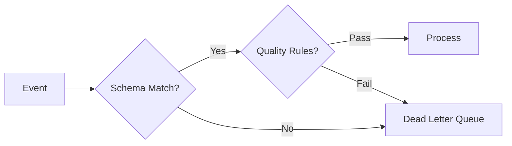

### 7. Foundation: Multi-Environment Setup
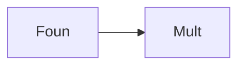

### 8. Networking: Secure Stream Tunnels
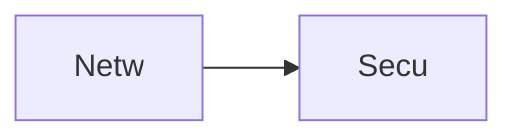

### 9. Component: Ingestion Engine
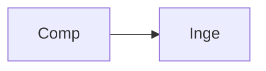

### 10. Component: Broker Engine
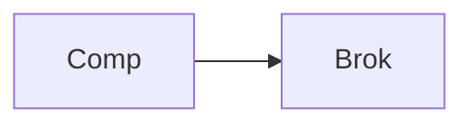

### 11. Component: Processing Engine
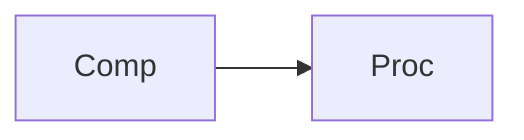

### 12. Component: Routing Engine


### 13. Logic: Partition Logic
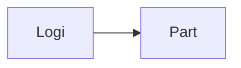

### 14. Logic: Windowing Logic
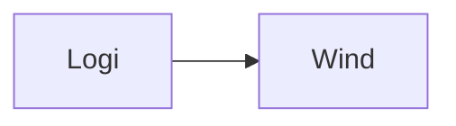

### 15. Logic: Schema Evolution
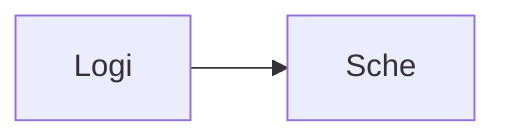

### 16. Logic: Quality Rule Evaluator
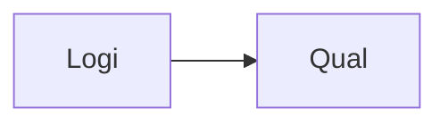

### 17. Architecture: Global Data Plane
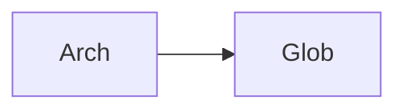

### 18. Architecture: Event-Driven Processing
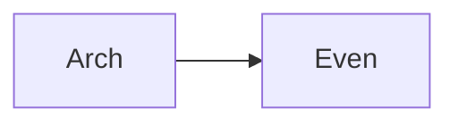

### 19. Architecture: Multi-Sink Connectivity
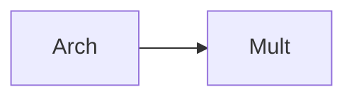

### 20. Pattern: Streams-as-Code
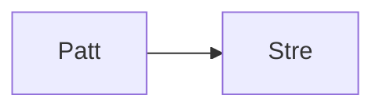

### 21. Pattern: Consumer Group Isolation
```mermaid
graph LR
    P[Patt] --> C[Cons]
```

### 22. Pattern: Windowed Aggregation
```mermaid
graph LR
    P[Patt] --> W[Wind]
```

### 23. Security: Signed Stream Payloads
```mermaid
graph LR
    S[Secu] --> S[Sign]
```

### 24. Security: RBAC Stream Access
```mermaid
graph LR
    S[Secu] --> R[RBAC]
```

### 25. Security: Secure Audit Record
```mermaid
graph LR
    S[Secu] --> S[Secu]
```

### 26. Feature: Stream Monitoring Dashboard
```mermaid
graph LR
    F[Feat] --> S[Stre]
```

### 27. Feature: Topic Explorer UI
```mermaid
graph LR
    F[Feat] --> T[Topi]
```

### 28. Feature: Auto-generated Sink Docs
```mermaid
graph LR
    F[Feat] --> A[Auto]
```

### 29. Compliance: Data Retention Audits
```mermaid
graph LR
    C[Comp] --> D[Data]
```

### 30. Compliance: Audit Trail Persistence
```mermaid
graph LR
    C[Comp] --> A[Audi]
```

### 31. Infrastructure: Redis Message Store
```mermaid
graph LR
    I[Infr] --> R[Redi]
```

### 32. Infrastructure: Postgres Metadata DB
```mermaid
graph LR
    I[Infr] --> P[Post]
```

### 33. Deployment: Kubernetes Processing Pods
```mermaid
graph LR
    D[Depl] --> K[Kube]
```

### 34. Deployment: Multi-Region Stream Sync
```mermaid
graph LR
    D[Depl] --> M[Mult]
```

### 35. Monitoring: throughput KPI
```mermaid
graph LR
    M[Moni] --> T[Thro]
```

### 36. Monitoring: end-to-end latency
```mermaid
graph LR
    M[Moni] --> L[Late]
```

### 37. UI: Streaming Command Hub
```mermaid
graph LR
    U[UI] --> S[Stre]
```

### 38. UI: Topic Configuration UI
```mermaid
graph LR
    U[UI] --> T[Topi]
```

### 39. UI: Consumer Lag Dashboard
```mermaid
graph LR
    U[UI] --> C[Cons]
```

### 40. UI: Data Quality Heatmap
```mermaid
graph LR
    U[UI] --> D[Data]
```

### 41. CI/CD: Stream validation pipeline
```mermaid
graph LR
    C[CICD] --> S[Stre]
```

### 42. CI/CD: Processing engine tests
```mermaid
graph LR
    C[CICD] --> P[Proc]
```

### 43. Strategy: Real-time First Architecture
```mermaid
graph LR
    S[Stra] --> R[Real]
```

### 44. Strategy: Data-Driven Stream Routing
```mermaid
graph LR
    S[Stra] --> D[Data]
```

### 45. Feature: Multi-Cloud Connector Bridge
```mermaid
graph LR
    F[Feat] --> M[Mult]
```

### 46. Feature: Real-time Anomaly Alerts
```mermaid
graph LR
    F[Feat] --> R[Real]
```

### 47. Feature: Throughput Forecast
```mermaid
graph LR
    F[Feat] --> T[Thro]
```

### 48. Logic: Dead Letter Queue Handler
```mermaid
graph LR
    L[Logi] --> D[Dead]
```

### 49. Data Model: Message Payload
```mermaid
graph LR
    D[Data] --> M[Mess]
```

### 50. Enterprise Streaming Excellence
```mermaid
graph LR
    E[Entr] --> S[Stre]
```

---

## 🛠️ Technical Stack & Implementation

### Platform Engine & APIs
- **Framework**: Python 3.11+ / FastAPI.
- **Broker Engine**: Partition-aware messaging logic simulation with offset management.
- **Processing Engine**: Real-time transformation and enrichment worker threads.
- **Routing Engine**: Strategic event delivery with multi-sink support.
- **Quality Engine**: Schema-registry aware validation logic for streaming payloads.
- **Cache**: Redis for high-speed message brokering and task queuing.
- **Persistence**: PostgreSQL for stream metadata, topic configs, and audit records.
- **Observability**: Prometheus/Grafana integration for throughput and latency tracking.

### Frontend (Stream Dashboard)
- **Framework**: React 18 / Vite.
- **Theme**: Cyan / Slate (Modern Data Engineering & Streaming aesthetic).
- **Visualization**: Recharts for throughput areas and latency trends.

### Infrastructure
- **Runtime**: AWS EKS (Kubernetes).
- **Deployment**: Helm charts for broker clusters and processing workers.
- **IaC**: Terraform (Modular with Distributed Systems focus).

---

## 🚀 Deployment Guide

### Local Development
```bash
# Clone the repository
git clone https://github.com/devopstrio/streaming-ingestion-hub.git
cd streaming-ingestion-hub

# Setup environment
cp .env.example .env

# Launch the Streaming stack (API, Workers, DB, Redis, UI)
make up

# Trigger a real-time ingestion simulation
make ingest-simulation

# Run processing engine logic
make process-stream
```
Access the Streaming Hub at `http://localhost:3000`.

---

## 📜 License
Distributed under the MIT License. See `LICENSE` for more information.
