<div align="center">


<h1>Streaming Ingestion Hub</h1>

<p><strong>The Strategic Data Ingress & Processing Plane for Global Real-time Intelligence and Distributed Stream Governance.</strong></p>

[]()
[]()
[]()

<br/>

> **"Data in motion is data with purpose."** 
> **Streaming Ingestion Hub (Stream-Ops)** is an institutional-grade platform designed to provide a secure, measurable, and highly automated foundation for global real-time data ingestion. It orchestrates the entire lifecycle—from multi-source ingestion and partition-aware message brokering to real-time transformations and schema validation.

</div>

---

## 🏛️ Executive Summary

In a real-time world, batch processing is a liability. Organizations often fail to leverage data not because of a lack of volume, but because of fragmented ingestion pipelines and the inability to process and route streams at the speed of business.

This platform provides the **Streaming Data Plane**. It implements a complete **Streaming Intelligence Framework**, enabling Data Engineering and SRE teams to manage event-driven infrastructure as a first-class citizen. By automating brokering, transformation, and routing, we ensure that global data is continuously delivered with strategic operational precision.

---

## 📐 Architecture Storytelling: Principal Reference Models

### 1. Principal Architecture: Global Real-Time Event Ingestion Plane
This diagram illustrates the end-to-end flow from disparate event sources to high-speed brokers and distributed data sinks.

```mermaid
graph LR
    %% Subgraph Definitions
    subgraph EventSources["Event Generation Sources"]
        direction TB
        IoT["IoT Edge Devices"]
        Web["Web/Mobile Applications"]
        Legacy["Legacy Mainframe Hooks"]
    end

    subgraph IngestionPlane["Data Ingress & Validation"]
        direction TB
        API["FastAPI Ingestion Gateway"]
        Registry["Schema Registry (Avro/Protobuf)"]
        Balancer["Ingress Load Balancer"]
    end

    subgraph BrokerGrid["Distributed Event Broker Grid"]
        direction TB
        Leader["Primary Broker (Leader)"]
        Follower["Replication Node (Follower)"]
        Zk["Coordination Service (ZK/KRaft)"]
    end

    subgraph ProcessingZone["Real-Time Transformation Hub"]
        direction TB
        Worker["Streaming Processing Workers"]
        DLQ["Dead Letter Queue (DLQ)"]
        Logic["Event-Driven Business Logic"]
    end

    subgraph Sinks["Global Data Sinks"]
        direction TB
        Lake["Data Lake (S3/ADLS)"]
        Warehouse["Data Warehouse (Snowflake)"]
        RealTime["Real-Time Analytics DB"]
    end

    subgraph DevOps["Stream-Ops & IaC Orchestration"]
        direction TB
        GH["GitHub Actions (CI/CD)"]
        TF["Terraform Stream Modules"]
        Prom["Prometheus (Throughput/Lag)"]
    end

    %% Flow Arrows
    EventSources -->|1. Emit Events| API
    API -->|2. Validate Schema| Registry
    Registry -->|3. Approved| Leader
    Leader -->|4. Replicate| Follower
    
    Leader -->|5. Consume| Worker
    Worker -->|6. Transform| Logic
    Logic -->|7. Route| Sinks
    Worker -->|8. Poison Message| DLQ
    
    GH -->|9. Manage| TF
    TF -->|10. Provision| BrokerGrid
    Leader -->|Telemetery| Prom

    %% Styling
    classDef source fill:#f5f5f5,stroke:#616161,stroke-width:2px;
    classDef ingest fill:#fff3e0,stroke:#e65100,stroke-width:2px;
    classDef broker fill:#ede7f6,stroke:#311b92,stroke-width:2px;
    classDef process fill:#e8f5e9,stroke:#1b5e20,stroke-width:2px;
    classDef sink fill:#fce4ec,stroke:#880e4f,stroke-width:2px;
    classDef devops fill:#fffde7,stroke:#f57f17,stroke-width:2px;

    class EventSources source;
    class IngestionPlane ingest;
    class BrokerGrid broker;
    class ProcessingZone process;
    class Sinks sink;
    class DevOps devops;
```

### 2. The Streaming Lifecycle: Source to Sink
The automated path of a single event transaction across the ingestion hub.

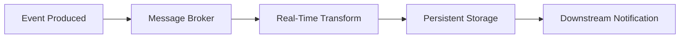

### 3. Lambda/Kappa Architecture Hub
Supporting both batch and real-time processing paths for unified data views.

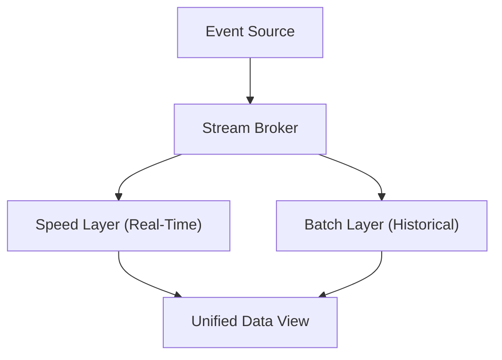

### 4. Schema Registry & Governance
Ensuring data quality through strict schema validation and evolution rules.

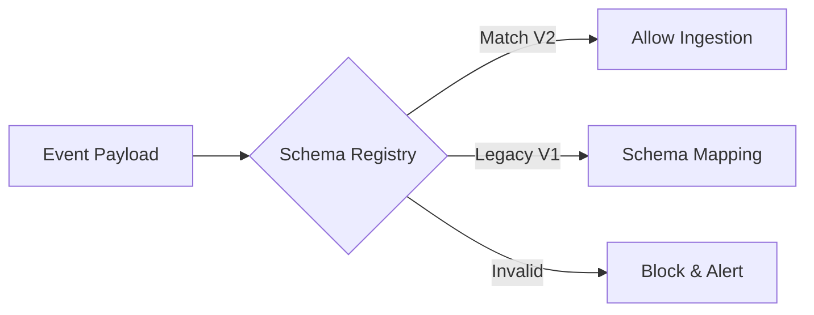

### 5. Multi-Region Event Mirroring
Building global resilience through cross-cluster asynchronous replication.

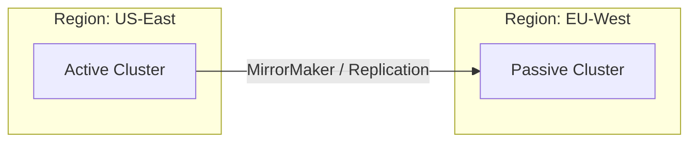

### 6. Dead Letter Queue (DLQ) & Error Handling
Managing poison messages and transient failures without stopping the stream.

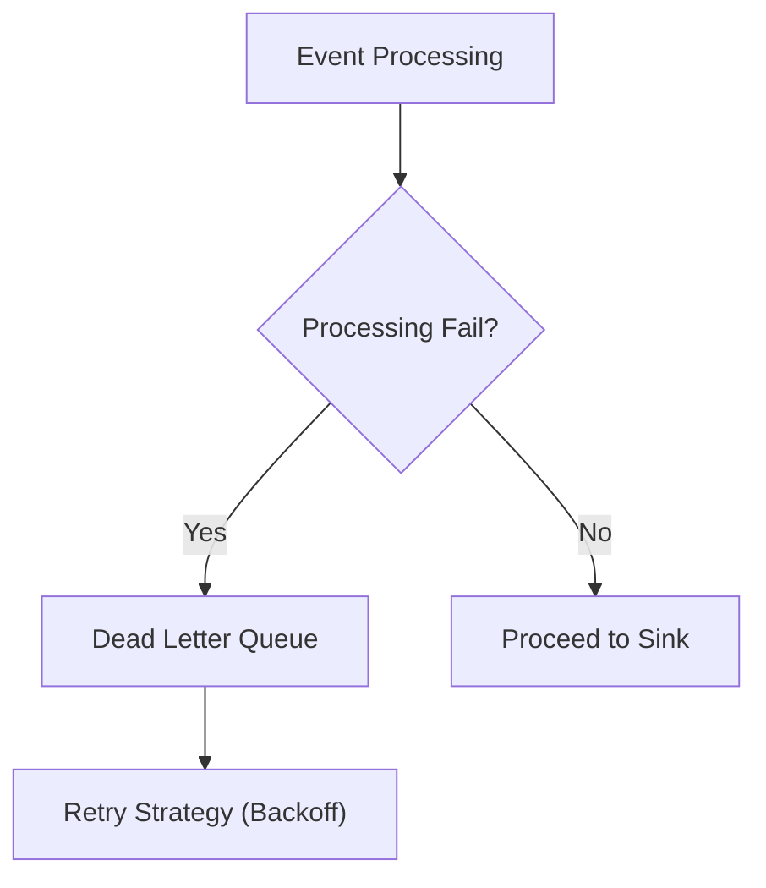

### 7. Exactly-Once Processing Logic
Ensuring data integrity through transactional producers and idempotency.

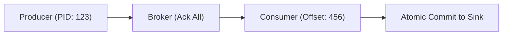

### 8. Identity & RBAC for Streaming Ops
Securing topics and consumer groups through fine-grained ACLs.

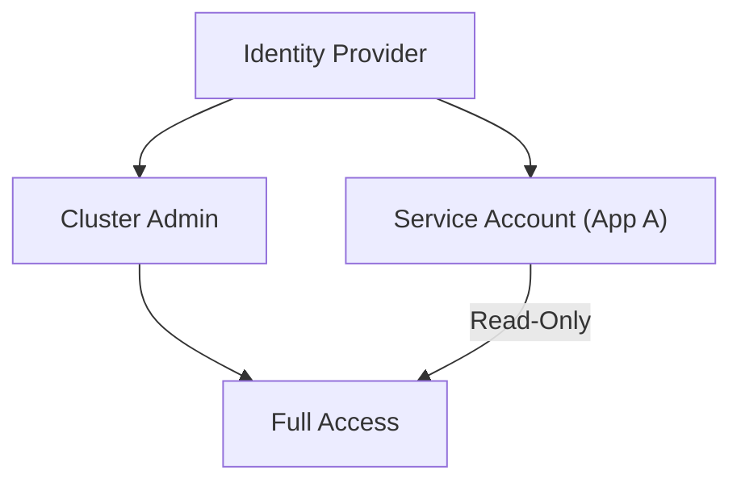

### 9. Observability: Throughput & Consumer Lag
Real-time monitoring of broker health and consumer processing speed.

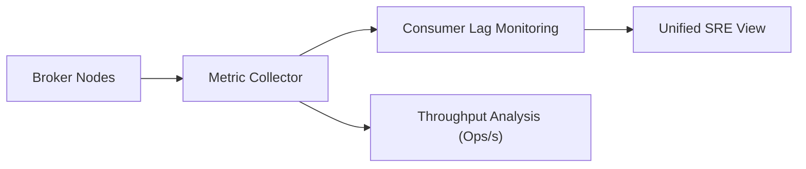

### 10. IaC Deployment: Event-Driven Infrastructure
Scaling the streaming grid across cloud providers using Terraform modules.

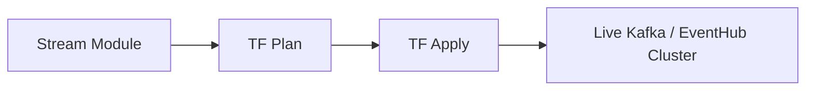

### 11. Metadata Lake for Forensic Event Auditing
Storing historical records of all stream transactions for institutional compliance.

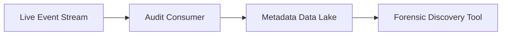

---

## 🏛️ Core Platform Pillars

1.  **Multi-Source Ingestion**: Centralized hub for ingesting real-time events via HTTP, Webhooks, and batch streams.
2.  **Distributed Broker Engine**: Partition-aware messaging logic ensuring scalability and message ordering.
3.  **Real-time Transformation Engine**: Policy-driven stream processing for filtering, enrichment, and windowed aggregations.
4.  **Strategic Routing Engine**: Rule-based logic for delivering processed streams to multiple destinations.
5.  **Data Quality & Schema Governance**: Automated validation of event schemas and quality rules to prevent stream pollution.
6.  **Cluster Observability**: Deep monitoring of throughput, latency, and consumer lag across the grid.

---

## 🛠️ Technical Stack & Implementation

### Platform Engine & APIs
*   **Framework**: Python 3.11+ / FastAPI.
*   **Broker Engine**: Simulated partition-aware messaging logic with offset management.
*   **Processing Engine**: Real-time transformation and enrichment workers.
*   **Quality Engine**: Schema-registry aware validation for streaming payloads.
*   **State Management**: PostgreSQL (Metadata) and Redis (Message Brokering).

### Streaming Hub (UI)
*   **Framework**: React 18 / Vite.
*   **Theme**: Cyan / Slate (Modern Data Engineering & Streaming aesthetic).
*   **Visualization**: Recharts for throughput areas and consumer lag trends.

### Infrastructure & DevOps
*   **Runtime**: AWS EKS or Azure Kubernetes Service (AKS).
*   **IaC**: Modular Terraform for deploying broker clusters and processing workers.

---

## 🏗️ IaC Mapping (Module Structure)

| Module | Purpose | Real Services |
| :--- | :--- | :--- |
| **`infrastructure/ingestion`** | Entry points for events | API Gateway, NLB, Cloud Functions |
| **`infrastructure/brokering`** | Core event bus | Kafka, EventHubs, Redis Streams |
| **`infrastructure/processing`** | Stream transformation nodes | Flink, Spark Streaming, K8s Workers |
| **`infrastructure/monitoring`** | Throughput and lag tracking | Prometheus, Grafana, Datadog |

---

## 🚀 Deployment Guide

### Local Principal Environment
```bash
# Clone the streaming hub
git clone https://github.com/devopstrio/streaming-ingestion-hub.git
cd streaming-ingestion-hub

# Configure environment
cp .env.example .env

# Launch the Streaming stack
make up

# Trigger a real-time ingestion simulation
make ingest-simulation

# Run processing engine logic
make process-stream
```

Access the Streaming Hub Dashboard at `http://localhost:3000`.

---

## 📜 License
Distributed under the MIT License. See `LICENSE` for more information.

---
<div align="center">
  <p>© 2026 Devopstrio. All rights reserved.</p>
</div>
